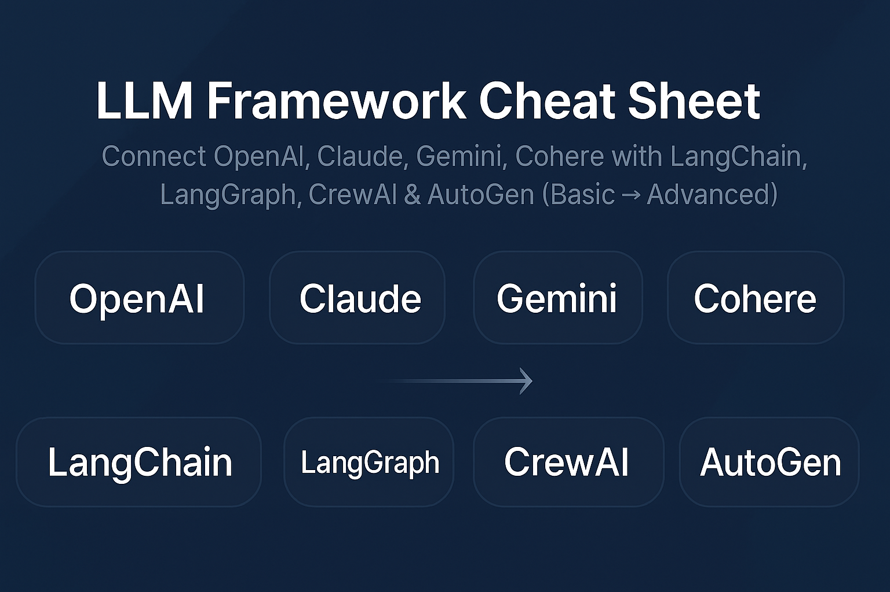

<p align="center">
  
</p>
# 📘 LLM Framework Cheat Sheet

### *Connect OpenAI, Claude, Gemini, Cohere with LangChain, LangGraph, CrewAI & AutoGen (Basic → Advanced)*


A complete **cheat sheet** for the **4 most used LLMs** and **4 most popular agentic frameworks** in Python.

✔ Beginner-friendly
✔ Advanced workflows included

---

## 🌟 What This Repo Covers

| Framework     | What You Learn                                                 |
| ------------- | -------------------------------------------------------------- |
| **LangChain** | Basic usage, streaming, tools, structured output, mini-RAG     |
| **LangGraph** | Node graphs, routing, branching logic                          |
| **CrewAI**    | Single & multi-agent workflows                                 |
| **AutoGen**   | Assistant agents, user proxy agents, multi-agent collaboration |

---

# 🚀 Quickstart

## 1️⃣ Clone

```
git clone https://github.com/YOUR_USERNAME/llm-framework-cheatsheet.git
cd llm-framework-cheatsheet
```

## 2️⃣ Virtual Environment (Recommended)

```
python -m venv venv
source venv/bin/activate   # macOS/Linux
venv\\Scripts\\activate      # Windows
```

## 3️⃣ Install Dependencies

```
pip install -r requirements.txt
```

## 4️⃣ Configure API Keys

```
cp .env.example .env
```

Fill in:

```
OPENAI_API_KEY=...
ANTHROPIC_API_KEY=...
GOOGLE_API_KEY=...
COHERE_API_KEY=...
```

---

# 📁 Project Structure

```
llm-framework-cheatsheet/
  langchain_cheatsheet.py
  langgraph_cheatsheet.py
  crewai_cheatsheet.py
  autogen_cheatsheet.py
  requirements.txt
  .env.example
  README.md
```

---

# 🔥 Highlights (Why This Repo Exists)

✔ Connect **OpenAI, Claude, Gemini, Cohere** in seconds
✔ Learn **all 4 major frameworks** in one place
✔ Understand the differences between frameworks
✔ See **advanced agentic patterns**
✔ Makes learning LLM frameworks simple for beginners

---

# 📘 Framework Overview

## LangChain (langchain_cheatsheet.py)

Includes:

* Basic prompts
* Streaming responses
* Structured output with Pydantic
* Tools/function-calling
* Mini RAG pipeline

## LangGraph(langgraph_cheatsheet.py)

Includes:

* Simple LLM node
* Router graph
* Branching workflow
* Deterministic state management

## CrewAI(crewai_cheatsheet.py)

Includes:

* Single LLM agent
* Multi-agent workflow
* Researcher → Writer pipeline

## AutoGen(autogen_cheatsheet.py)

Includes:

* Assistant agent
* User proxy agent
* Multi-agent collaboration
* Outline → Write flow

---

# 🧠 Choosing a Framework (Quick Comparison)

| Framework     | Difficulty | Strengths                      | Best For              |
| ------------- | ---------- | ------------------------------ | --------------------- |
| **LangChain** | Easy       | Tools, chains, RAG ecosystem   | Apps, chatbots        |
| **LangGraph** | Medium     | Control flow, branching, state | Complex agents        |
| **CrewAI**    | Medium     | Multi-agent orchestration      | Task pipelines        |
| **AutoGen**   | Medium     | Agent cooperation              | Research-style agents |

---

# ✨ Use Cases

Build:

* Chatbots
* Multi-agent workflows
* RAG-powered systems
* AI assistants
* LangGraph pipelines
* Autonomous agents
* Experimentation tools

Perfect for:

* Agentic AI learning

---

# 🧪 Run Examples

```
python langchain_cheatsheet.py
python langgraph_cheatsheet.py
python crewai_cheatsheet.py
python autogen_cheatsheet.py
```

---

# 🤝 Contributing

PRs welcome!

---

# 🛡 License

MIT License.

---

# ⭐ Support

If this repo helped you, please give it a ⭐ — it helps more developers discover it!
